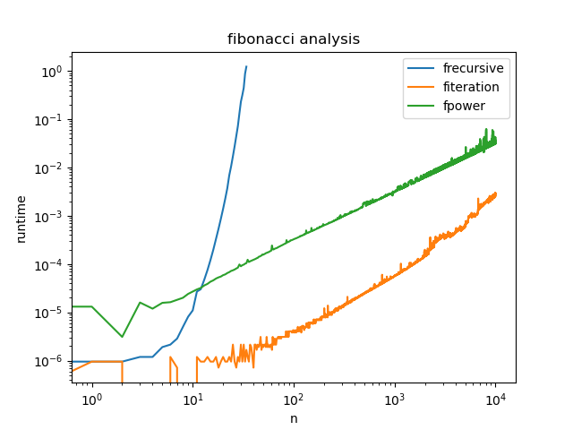

# Answers

Put any answers to questions in the assignment in this file, or any commentary you don't include in the code.

This is a markdown file (the `.md` extension gives it away). If you have never used markdown before, check out [this short guide](https://guides.github.com/features/mastering-markdown/).

## Problem 0
You don't need to say anything here.  Just complete [`fizzbuzz.py`](fizzbuzz.py).

## Problem 1
Floor(Log2(n))+#(n)-1 additions are done in the Egyptian multiplication algorithm.
## Problem 2
Fibonacci interation algorithm is faster since iteration don't do repeated calculations.
## Problem 3
The number of operations done in this algorithm is max(4n-8,0). The algorithm in problem 2 is better. Currently the type is integer, fibnacci_power will easily exceed the int's range, which will cause the overflow of number. Yes, it would be better to use np.float64 or np.int64. 
## Problem 4

When n is small, the recursion works fine, almost as good as iteration, however, power is the worst. When n is large, the recursion became the worst one, iteration is still working wonderful, power is between them.
## Feedback
The assignment is okay, it takes 6 hours to complete it. It takes really long time to debug with github pytest. Could I please ask is that possible if you can use submitty(from Rensselaer Polytechnic Institute) to debug and check our code? 
